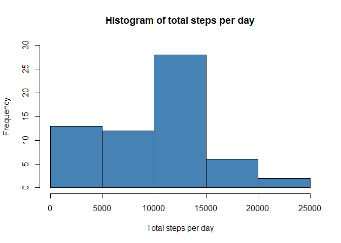
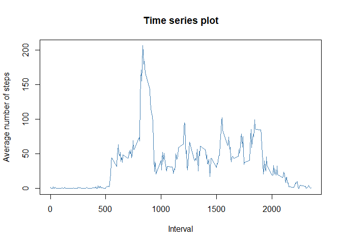
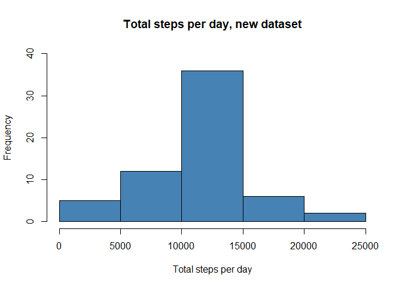
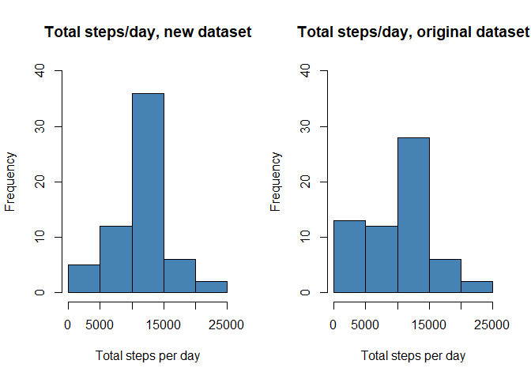
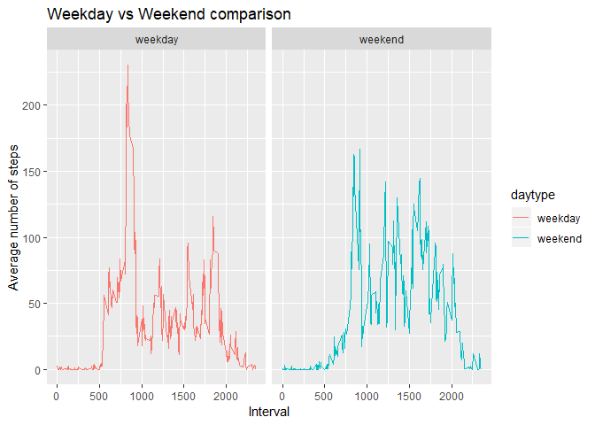

--- 
title: "Reproducible Research: Peer Assessment 1" 
output: 
  html_document: 
    keep_md: true 
---

*R Kurien*

*May 10, 2019*


## Loading and preprocessing the data


```r
library(dplyr)
library(ggplot2)
```

Read the data from file


```r
if (!file.exists("activity.csv")) {
  unzip("activity.zip")
}
activity<-read.csv("activity.csv",stringsAsFactors=FALSE)
str(activity)
```

```
## 'data.frame':	17568 obs. of  3 variables:
##  $ steps   : int  NA NA NA NA NA NA NA NA NA NA ...
##  $ date    : chr  "2012-10-01" "2012-10-01" "2012-10-01" "2012-10-01" ...
##  $ interval: int  0 5 10 15 20 25 30 35 40 45 ...
```

```r
activity$date<-as.Date(as.character(activity$date))
summary(activity)
```

```
##      steps             date               interval     
##  Min.   :  0.00   Min.   :2012-10-01   Min.   :   0.0  
##  1st Qu.:  0.00   1st Qu.:2012-10-16   1st Qu.: 588.8  
##  Median :  0.00   Median :2012-10-31   Median :1177.5  
##  Mean   : 37.38   Mean   :2012-10-31   Mean   :1177.5  
##  3rd Qu.: 12.00   3rd Qu.:2012-11-15   3rd Qu.:1766.2  
##  Max.   :806.00   Max.   :2012-11-30   Max.   :2355.0  
##  NA's   :2304
```


## What is mean total number of steps taken per day?
### 1.Calculate the total number of steps taken per day

```r
daily_activity <- with(activity, aggregate(steps, by = list(date), FUN = sum, na.rm = TRUE))
names(daily_activity)<-c('date', 'totalsteps')
head(daily_activity)
```

```
##         date totalsteps
## 1 2012-10-01          0
## 2 2012-10-02        126
## 3 2012-10-03      11352
## 4 2012-10-04      12116
## 5 2012-10-05      13294
## 6 2012-10-06      15420
```

### 2.Make a histogram of the total number of steps taken each day

```r
hist(daily_activity$totalsteps, main = "Histogram of total steps per day", xlab = "Total steps per day", col = "steelblue", ylim=c(0,30))
```

<!-- -->

### 3.Calculate and report the mean and median of the total number of steps taken per day


```r
mean(daily_activity$totalsteps)
```

```
## [1] 9354.23
```

```r
median(daily_activity$totalsteps)
```

```
## [1] 10395
```

## What is the average daily activity pattern?
### 1.Make a time series plot (i.e. type="l") of the 5-minute interval (x-axis) and the average number of steps taken, averaged across all days (y-axis)


```r
average_daily_activity <- with(activity, aggregate(steps, by=list(interval), FUN=mean, na.rm=TRUE))
names(average_daily_activity) <- c("interval", "mean")
#head(average_daily_activity)
with(average_daily_activity,plot(interval, mean, type = "l", col="steelblue", xlab="Interval", ylab="Average number of steps", main="Time series plot"))
```

<!-- -->

### 2.Which 5-minute interval, on average across all the days in the dataset, contains the maximum number of steps?


```r
average_daily_activity[which.max(average_daily_activity$mean), ]$interval
```

```
## [1] 835
```


## Imputing missing values
#### Note: that there are a number of days/intervals where there are missing values (coded as NA).
### 1.Calculate and report the total number of missing values in the dataset (i.e. the total number of rows with NAs)


```r
sum(is.na(activity$steps))
```

```
## [1] 2304
```

### 2.Devise a strategy for filling in all of the missing values in the dataset. The strategy does not need to be sophisticated. For example, you could use the mean/median for that day, or the mean for that 5-minute interval, etc.

- imputing using mean for that 5-minute interval
- mean is already present in average_daily_activity
- merge both dataframes by interval
- set steps to be same as corresponding mean value
- drop mean column and order rows and columns as original data

### 3.Create a new dataset that is equal to the original dataset but with the missing data filled in.


```r
new_dataset<-merge(activity,average_daily_activity, by.x = "interval", all = TRUE)
new_dataset$steps[is.na(new_dataset$steps)]<- new_dataset$mean[is.na(new_dataset$steps)]

new_dataset<-select(new_dataset,steps, date, interval) %>%
  arrange(date,interval)
head(new_dataset)
```

```
##       steps       date interval
## 1 1.7169811 2012-10-01        0
## 2 0.3396226 2012-10-01        5
## 3 0.1320755 2012-10-01       10
## 4 0.1509434 2012-10-01       15
## 5 0.0754717 2012-10-01       20
## 6 2.0943396 2012-10-01       25
```

### 4.Make a histogram of the total number of steps taken each day. 


```r
daily_activity2 <- with(new_dataset, aggregate(steps, by = list(date), FUN = sum, na.rm = TRUE))
names(daily_activity2)<-c('date', 'totalsteps')
hist(daily_activity2$totalsteps, main = "Total steps per day, new dataset", xlab = "Total steps per day", col = "steelblue", ylim=c(0,40))
```

<!-- -->

#### Calculate and report the mean and median total number of steps taken per day.


```r
mean(daily_activity2$totalsteps)
```

```
## [1] 10766.19
```

```r
median(daily_activity2$totalsteps)
```

```
## [1] 10766.19
```

#### Do these values differ from the estimates from the first part of the assignment?
Yes, they do differ.


```r
par(mfrow=c(1,2))
hist(daily_activity2$totalsteps, main = "Total steps/day, new dataset", xlab = "Total steps per day", col = "steelblue", ylim=c(0,40))
hist(daily_activity$totalsteps, main = "Total steps/day, original dataset", xlab = "Total steps per day", col = "steelblue", ylim=c(0,40))
```

<!-- -->

#### What is the impact of imputing missing data on the estimates of the total daily number of steps?


```r
summary(daily_activity)
```

```
##       date              totalsteps   
##  Min.   :2012-10-01   Min.   :    0  
##  1st Qu.:2012-10-16   1st Qu.: 6778  
##  Median :2012-10-31   Median :10395  
##  Mean   :2012-10-31   Mean   : 9354  
##  3rd Qu.:2012-11-15   3rd Qu.:12811  
##  Max.   :2012-11-30   Max.   :21194
```

```r
summary(daily_activity2)
```

```
##       date              totalsteps   
##  Min.   :2012-10-01   Min.   :   41  
##  1st Qu.:2012-10-16   1st Qu.: 9819  
##  Median :2012-10-31   Median :10766  
##  Mean   :2012-10-31   Mean   :10766  
##  3rd Qu.:2012-11-15   3rd Qu.:12811  
##  Max.   :2012-11-30   Max.   :21194
```

The above summary of both daily_activity (original dataset) and dailyactivity2 (new dataset) shows that the median and mean has increased with addition of missing data. Also the mean and median are of same value.

## Are there differences in activity patterns between weekdays and weekends?
#### (Use the dataset with the filled-in missing values)

### 1.Create a new factor variable in the dataset with two levels - "weekday" and "weekend" indicating whether a given date is a weekday or weekend day.


```r
new_dataset$daytype <- as.factor(sapply(new_dataset$date, function(x) {
  ifelse ((weekdays(x) == "Saturday" | weekdays(x) =="Sunday"),"weekend","weekday")
}))
```

### 2.Make a panel plot containing a time series plot (i.e. type="l") of the 5-minute interval (x-axis) and the average number of steps taken, averaged across all weekday days or weekend days (y-axis).


```r
avg_daily_newdata <- with(new_dataset, aggregate(steps~interval + daytype, FUN=mean, na.rm=TRUE))
g<- ggplot(avg_daily_newdata, aes(x = interval , y = steps, color = daytype))
  g+geom_line() +
  labs(title = "Weekday vs Weekend comparison", x = "Interval", y = "Average number of steps") +
  facet_wrap(~daytype)
```

<!-- -->
